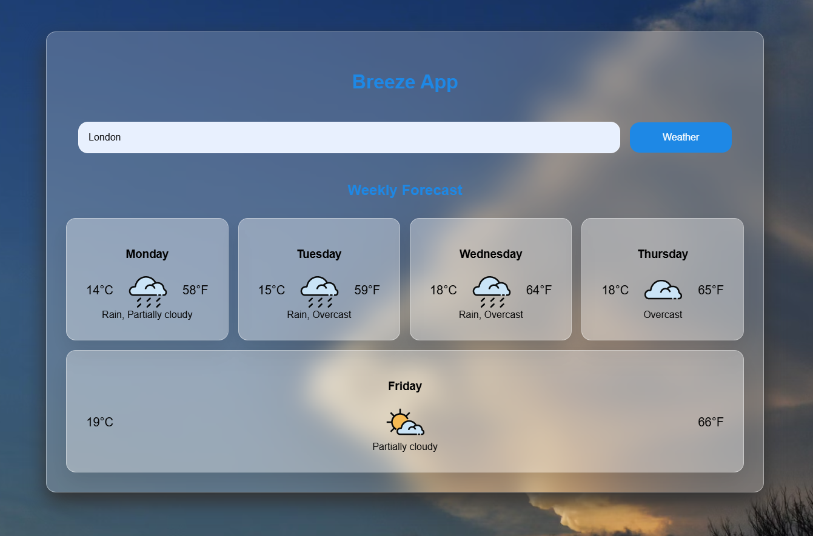

# 🌬️ Breeze - Weather App

Breeze is a simple, responsive weather application built with vanilla JavaScript, HTML, and CSS. It fetches real-time weather data and a 5-day forecast using the Visual Crossing Weather API.

[](https://ioangheraszim.github.io/breeze/)

## 

---

## 🚀 Features

- 🔍 Search for weather by city name
- 🌤️ Displays current weather and 5-day forecast
- 🌡️  Temperatures shown in Celsius and Fahrenheit
- 🖼️ Weather icons for visual clarity
- ⚡ Built with Webpack (modular JS structure)

---

## 🛠️ Technologies Used

- HTML5 + CSS3
- JavaScript (ES6+)
- Webpack (for bundling)
- [Visual Crossing Weather API](https://www.visualcrossing.com/)

---

## 📦 Setup Instructions

1. **Clone the repository:**

```bash
git clone https://github.com/ioangheraszim/breeze-weather-app.git
cd breeze-weather-app
```

2. **Install dependencies:**

```bash
npm install
```

3. **Run the app locally:**

```bash
npm run start
```

4. **Build for production:**

```bash
npm run build
```

---

## 🔑 API Key Setup

This app uses the Visual Crossing Weather API.

- Replace the placeholder API key in fetchWeather.js:

```javascript
const myKey = "YOUR_API_KEY";
```

Get your free key from [Visual Crossing](https://www.visualcrossing.com/weather-api).

---

## 📁 Project Structure

```css
/src
  ├── components/
  │   ├── Content.js
  │   ├── ForecastCard.js
  │   ├── Header.js
  │   ├── InputForm.js
  │   └── WeatherInfo.js
  ├── fetchWeather.js
  ├── index.js
  └── styles.css
.gitignore
README.md
LICENCE
package-lock.json
package.json
webpack.dev.js
webpack.prod.js
```

---

## 🧠 Learning Goals

- This project was built to practice:

- Modular frontend development

- Working with Webpack

- Fetching and handling API data

- DOM manipulation without frameworks

- Structuring a mini frontend project from scratch

---

## 📄 License

MIT

---

## 🙌 Acknowledgments

- [Visual Crossing](https://www.visualcrossing.com/weather-api)

- Icons from Visual Crossing Weather Icons set
